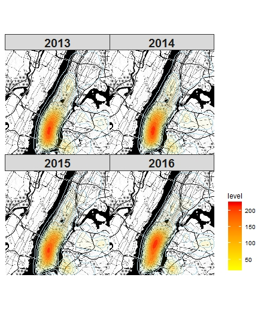

### Map about the Distribution of Collisions and Persons injured/killed

* First, I wanted to draw static maps or plots about the bicycle collisions so the packages here used are ggplot2 and tmap. Since there are so many accidents occuring during 2013 and 2016, it is difficult to show the trends of all of them in a line plot or histogram. So the basic thing here is to draw a map with all the collision points on it. That it how the first two ggmaps came from. Then I have tried to split the density map into each year from 2013 to 2016. Unfortunately, the trend is not so obvious. I also included 2017 density later and there seemed to have a distinct feature but it made no sense because our citi bike data is from 2013 to 2016. Here is the density map of 2013 to 2016:




* For the tmap part, my initial idea is to group the collision points by each neighbourhood and draw like a box plot, with the medium and extreme values. However, as I have said, there are still too many information even though I used neighbourhood to reduce the points. The big difficulty here is that there is only zip code of each collision point in the dataset rather than the fips code that we commonly use. So it took me a lot of time to find the useful map data. Finally, I chose to use the over() function in R to connect the neighbourhood map used in our class and the collision point data. And the result is what you can see in the second tmap. 

### Interactive Map about the Number of Persons injured/killed

* Because I wanted to reflect the information that how many persons injured/killed at each collision point, this map could not be ploted as a density map like the above collision one. Here I used the interactive map to do this job. At first, I did not use the black background like it currently shows and distinguish each year's points by four colors. But it is a little hard to tell the trend. So later I adjusted the background map, the color and the opacity.

```{r, warning=FALSE, message=FALSE}
load(".RData")
library(leaflet)
library(dplyr)
in2_draft %>% hideGroup(c("2014","2015","2016"))
```

### ShinyApp Map

* ShinyApp is the last part of our study so I only had several days to capture the knowledge. At first, I did not intend to draw such a plot that each click on the map would activate the correponding line plots of the number of collisions and persons injured/killed. The first app I built is based on the neighbourhood names in the check box. Once the user chooses the neighourhood, bottom appears the two line plots. However, the old problem occured again, that is, there are so many neighbourhoods so only the plots may not be able to show the geographic relationship. Here are part of the codes of my first app:

```{r, warning=FALSE}
server <- function(input, output) {
  output$nameOutput <- renderUI({
    selectInput("nameInput", "Neighbourhood: ", sort(unique(shiny3$NTAName)),
                selected = "Allerton")
    })  
  
  filtered <- reactive({
    if (is.null(input$nameInput)) {
      return(NULL)
    }
    
    shiny3 %>% filter( NTAName == input$nameInput )
    })
  
  output$lineplot1 <- renderPlot({
    if (is.null(filtered())) {
      return()
      }
    ggplot(filtered(), aes(x=year, y=Frequency)) + geom_line(color="red")
    })
  
  output$lineplot2 <- renderPlot({
    if (is.null(filtered())) {
      return()
      }
    ggplot(filtered(), aes(x=year, y=injured_killed)) + geom_line(color="blue")
    })
  }
```


