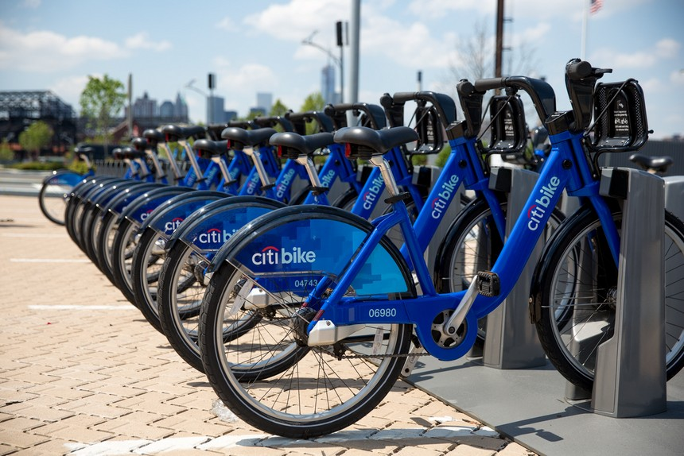

```{r, include = FALSE, echo = FALSE, warning = FALSE}
## Map Style
library(RJSONIO)
library(tidyverse)

style<-'[
  {
"elementType": "geometry",
"stylers": [
{
  "color": "#212121"
}
]
},
{
  "elementType": "labels",
  "stylers": [
  {
  "visibility": "off"
  }
  ]
},
  {
  "elementType": "labels.icon",
  "stylers": [
  {
  "visibility": "off"
  }
  ]
  },
  {
  "elementType": "labels.text.fill",
  "stylers": [
  {
  "color": "#757575"
  }
  ]
  },
  {
  "elementType": "labels.text.stroke",
  "stylers": [
  {
  "color": "#212121"
  }
  ]
  },
  {
  "featureType": "administrative",
  "elementType": "geometry",
  "stylers": [
  {
  "color": "#757575"
  }
  ]
  },
  {
  "featureType": "administrative.country",
  "elementType": "labels.text.fill",
  "stylers": [
  {
  "color": "#9e9e9e"
  }
  ]
  },
  {
  "featureType": "administrative.land_parcel",
  "stylers": [
  {
  "visibility": "off"
  }
  ]
  },
  {
  "featureType": "administrative.locality",
  "elementType": "labels.text.fill",
  "stylers": [
  {
  "color": "#bdbdbd"
  }
  ]
  },
  {
  "featureType": "administrative.neighborhood",
  "stylers": [
  {
  "visibility": "off"
  }
  ]
  },
  {
  "featureType": "poi",
  "elementType": "labels.text.fill",
  "stylers": [
  {
  "color": "#757575"
  }
  ]
  },
  {
  "featureType": "poi.park",
  "elementType": "geometry",
  "stylers": [
  {
  "color": "#181818"
  }
  ]
  },
  {
  "featureType": "poi.park",
  "elementType": "labels.text.fill",
  "stylers": [
  {
  "color": "#616161"
  }
  ]
  },
  {
  "featureType": "poi.park",
  "elementType": "labels.text.stroke",
  "stylers": [
  {
  "color": "#1b1b1b"
  }
  ]
  },
  {
  "featureType": "road",
  "elementType": "geometry.fill",
  "stylers": [
  {
  "color": "#2c2c2c"
  }
  ]
  },
  {
  "featureType": "road",
  "elementType": "labels.text.fill",
  "stylers": [
  {
  "color": "#8a8a8a"
  }
  ]
  },
  {
  "featureType": "road.arterial",
  "elementType": "geometry",
  "stylers": [
  {
  "color": "#373737"
  }
  ]
  },
  {
  "featureType": "road.highway",
  "elementType": "geometry",
  "stylers": [
  {
  "color": "#3c3c3c"
  }
  ]
  },
  {
  "featureType": "road.highway.controlled_access",
  "elementType": "geometry",
  "stylers": [
  {
  "color": "#4e4e4e"
  }
  ]
  },
  {
  "featureType": "road.local",
  "elementType": "labels.text.fill",
  "stylers": [
  {
  "color": "#616161"
  }
  ]
  },
  {
  "featureType": "transit",
  "elementType": "labels.text.fill",
  "stylers": [
  {
  "color": "#757575"
  }
  ]
  },
  {
  "featureType": "water",
  "elementType": "geometry",
  "stylers": [
  {
  "color": "#000000"
  }
  ]
  },
  {
  "featureType": "water",
  "elementType": "labels.text.fill",
  "stylers": [
  {
  "color": "#3d3d3d"
  }
  ]
  }
  ]'
style_list<- fromJSON(style, asText = TRUE)

create_style_string<- function(style_list){
  style_string <- ""
  for(i in 1:length(style_list)){
    if("featureType" %in% names(style_list[[i]])){
      style_string <- paste0(style_string, "feature:", 
                             style_list[[i]]$featureType, "|")      
    }
    elements <- style_list[[i]]$stylers
    style_string<-paste0(style_string,"element:",style_list[[i]]$elementType,"|")
    a <- lapply(elements, function(x)paste0(names(x), ":", x)) %>%
      unlist() %>%
      paste0(collapse="|")
    style_string <- paste0(style_string, a)
    if(i < length(style_list)){
      style_string <- paste0(style_string, "&style=")       
    }
  }  
  # google wants 0xff0000 not #ff0000
  style_string <- gsub("#", "0x", style_string)
  return(style_string)
}

style_string<- create_style_string(style_list)

```

```{r, echo = FALSE, warning = FALSE, include=FALSE}
library(ggplot2)
library(ggmap)
citi_stations_201608 <- read.csv("data/citi_stations_201608.csv", header = TRUE, sep = " ")
B <- read.csv("data/Frequent_B.csv", header = TRUE, sep = " ")
nyc_map <- get_googlemap("east vallage", zoom = 12, style = style_string, maptype = "roadmap")
```

```{r, echo = FALSE, warning = FALSE}
# ggmap(nyc_map) + 
#   geom_segment(data = B, 
#                mapping = aes(x = s_long, y = s_lat,
#                            xend = e_long, yend = e_lat,
#                            alpha = freq), 
#                color = "gold") +
#   geom_point(data = citi_stations_201608, mapping = aes(x = long, y = lat),
#              color = "red", size = 0.05, alpha = 0.4) + 
#   scale_alpha_continuous( range = c(0.008, 0.01) ) + 
#   guides(alpha = FALSE) + 
#   theme(axis.title.x=element_blank(),
#         axis.text.x=element_blank(),
#         axis.ticks.x=element_blank(),
#         axis.title.y=element_blank(),
#         axis.text.y=element_blank(),
#         axis.ticks.y=element_blank())
#   

## rmarkdown::render_site()
```

Citi Bike is the nation's largest bike share program, with 10,000 bikes and 600 stations across Manhattan, Brooklyn, Queens and Jersey City. It was designed for quick trips with convenience in mind, and it’s a fun and affordable way to get around town. In this project, we're going to conduct a case study on the citibike dataset. We'll be looking at NYC traffic data and try to predict/visualize how different factors affect daily bike requirements. Looking at population data, local attractions data to predict where new stations could be opened or how has citibike used this data to expand. In this project, using Twitter data, we’ll try to visualize how sentiments affect prices. We’ll look at which stations serve which neighbourhoods. We’ll look at the citibike customer base to find patterns within the demographics that citibike serves.

