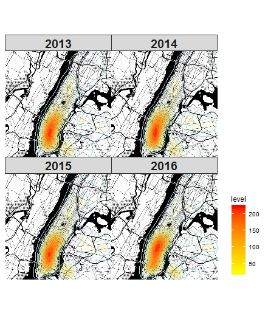

### Overview and Motivation

[Citi Bike](http://www.citibikenyc.com) is the nation’s largest bike share program, with 10,000 bikes and 600 stations across Manhattan, Brooklyn, Queens and Jersey City. It was designed for quick trips with convenience in mind, and it’s a fun and affordable way to get around town. 

In this project, we’re going to conduct a case study about Citi Bike usage. We’ll be looking at the open source Citi Bike dataset as well as NYC traffic and transportation data and Twitter data, and try to visualize the growth of Citi Bike in terms of usage, expansion and membership, the daily using pattern, different factors affect bike usage, and the image of Citi Bike on the social media. 

### Related Work

There have already been several visualizations and studies about Citi Bike on the Internet, since the data is open source encouraging everyone to use for study. Here are some previous works about Citi Bike on the Internet: 

+ [Citi Bike Stations](https://member.citibikenyc.com/map/)

+ [A Tale of Twenty-Two Million Citi Bike Rides: Analyzing the NYC Bike Share System](http://toddwschneider.com/posts/a-tale-of-twenty-two-million-citi-bikes-analyzing-the-nyc-bike-share-system/) by Todd W. Schneider.

+ [INTERACTIVE: A MONTH OF CITI BIKE](http://www.newyorker.com/news/news-desk/interactive-a-month-of-citi-bike) by [Michael Guerriero](http://www.newyorker.com/contributors/michael-guerriero) 

+ [Interactive map: bike movements in New York City and Washington, D.C.](http://radar.oreilly.com/2013/07/interactive-maps-bike-share-new-york-washington-citibike.html) by [Jon Bruner](http://radar.oreilly.com/jbruner)

+ [Where Did All the Bikes Go? An Analysis on NYC Citi Bike Station Capacity](https://blog.nycdatascience.com/student-works/bikes-go-analysis-nyc-citi-bike-station-capacity/) by [Jhonasttan Regalado](https://blog.nycdatascience.com/author/jhonasttan/)

However most of the existed studies focus on the Citi Bike usage data itself and are on a daily basis, some of them also have efforts on the user profile. While what our study try to do, based on the existing ones, is studying Citi Bike in a historical growth perspective, combining other related dataset to look at Citi Bike as one of the elements in NYC environment, and looking into social media to study the social image of Citi Bike. 

### Questions

The questions we want to address in this study are:

+ What is the pattern (miles, time, routine, etc.) of Citi Bike usage in the daily, quarterly and yearly perspective? 

+ What is the history of Citi Bike since its establishment? How is the growth of numbers of users and members? How did it expand over the city?

+ What is the role of Citi Bike in NYC daily life? What is the relationship between Citi Bike and other transportation?

+ What is the image of Citi Bike on the social media? What are the related topics? Is it positive or negative? Why?

+ Is riding Citi Bike safe in NYC?

### Data

We plan to apply the Citi Bike System Data, which is an open source database provided by [Citi Group](http://www.citigroup.com/citi/), containing Citi Bike trip histories, ridership and membership data and other additional relevant resources. 

The trip histories data include following variables: 

+ Trip Duration (seconds)
+ Start Time and Date
+ Stop Time and Date
+ Start Station Name
+ End Station Name
+ Station ID
+ Station Lat/Long
+ Bike ID
+ User Type (Customer = 24-hour pass or 7-day pass user; Subscriber = Annual Member)
+ Gender (Zero=unknown; 1=male; 2=female)
+ Year of Birth

The ridership and membership data include: 

+ Trips over the past 24-hours (midnight to 11:59pm)
+ Miles traveled today (midnight to 11:59 pm)
+ Total Annual Members (All Time)
+ 24-Hour Passes Purchased (midnight to 11:59 pm)
+ 3-Day Passes Purchased (midnight to 11:59 pm)

The City of New York’s bicycling data include:

+ Locations of the City's outdoor bicycle racks

In addition, we are using Twitter data to do text analysis about Citibike. We will stream tweets that mention Citibike in a certain period via Twitter API and apply frequency analysis, sentiment analysis and word clouds to describe the data, analyse user’s opinions towards Citibike and look for other interesting facts. 

All the datasets of Citibike can be downloaded in csv files in a clean form. The potential obstacle in data processing may be the streaming and processing of tweets data since the tweets can be very messy with tags, abbreviations and unrelated information. And we want to get the geographic information of every tweet to get the location of that bike trip, which we are not sure if available. 

The questions we want to ask of the data are just what we want to analyze mentioned in the abstract, since the data are all simply structured and contain most of the variables we need. 

Here are the linkages of the data: 

+ [Citi Bike Trip History](https://s3.amazonaws.com/tripdata/index.html)

+ [Citi Bike Daily Ridership and Membership Data](https://www.citibikenyc.com/system-data)

+ [Citi Bike Monthly Operating Report](https://www.citibikenyc.com/system-data/operating-reports)

+ [The City of New York's bicycling data](http://www.nyc.gov/html/dot/html/about/datafeeds.shtml#Bikes)

+ [New York Open Data](https://opendata.cityofnewyork.us)

### Exploratory Data Analysis: 

##### How did you start exploring your data? What did you find out? How did that help you structure the next steps?

Citi Bike has a good organized data set, which is available on internet. The data set contains several features, which includes spectral data (longitude and latitude) and time sequence. Also, The data also include monthly membership data and daily usage data. By these features, these question can be explored: 

+ Time series analysis for the seasonal usage and total number of membership 

+ Daily usage analysis

+ The growth of Citi Bike and the bike station locations

As a sharing public service company, what people comment for citi bike and how they think about it are important. R has a powerful tweeter API which can connect with tweet server and download corpus data, which allows us to do a text analysis, like sentiment Analysis.

Last, We found bike collisions data from [NYC Open Data](https://opendata.cityofnewyork.us), that allows us to do a correlation analysis between Citi Bike usage and NYC bike collision.

##### Design Evolution: 

Our initiative idea about the project is to build a general descriptive visualization to the Citi Bike dataset, including EDAs for all the variables mentioned in the Data section of this project book as well as any interesting relationship between any two of them. However we found out (credit to Prof. TB) that there have been already a bunch of articles about basic and some fancy visualization applications on the Internet. Hence, we decide to look at the dataset in a different perspective.

We then determined address our project on:

+ the daily usage of Citi Bike, which is not a new topic but a fundamental one to grab general comprehension of the dataset

+ the historical development of Citi Bike in terms of popularity and geographic expansion, which has not been covered much but is an interesting topic

+ the image of Citi Bike on social media, where we apply text analysis to study the related public posts and reviews online

+ the relationship with other elements in NYC, like transportation, traffic, or recreational sites, etc.

Due to the limitation of time, we cannot realize everything popping up from our mind so finally we narrowed down in some of the sections. In social media section we only look at tweets on Twitter as a sample of social media content. And for the last section, we choose to study Citi Bike usage’s relationship with subway and traffic collision data to study the role of Citi Bike as a commuting method and the safety/potential danger of Citi Bike riding.

##### Implementation: Give some ideas about the intent and functionality of the interactive visualizations you used in the final output.


* First, we wanted to draw static maps or plots about the bicycle collisions so the packages here used are ggplot2 and tmap. Since there are so many accidents occuring during 2013 and 2016, it is difficult to show the trends of all of them in a line plot or histogram. So the basic thing here is to draw a map with all the collision points on it. That it how the first two ggmaps came from. Then we have tried to split the density map into each year from 2013 to 2016. Unfortunately, the trend is not so obvious. We also included 2017 density later and there seemed to have a distinct feature but it made no sense because our citi bike data is from 2013 to 2016. Here is the density map of 2013 to 2016:




* For the tmap part, our initial idea is to group the collision points by each neighbourhood and draw like a box plot, with the medium and extreme values. However, as we said, there are still too many information even though this project used neighbourhood to reduce the points. The big difficulty here is that there is only zip code of each collision point in the dataset rather than the fips code that this project commonly use. So it took me a lot of time to find the useful map data. Finally, this project chose to use the over() function in R to connect the neighbourhood map used in our class and the collision point data. And the result is what you can see in the second tmap. 

### Interactive Map about the Number of Persons injured/killed

* Because we wanted to reflect the information that how many persons injured/killed at each collision point, this map could not be ploted as a density map like the above collision one. Here, this project used the interactive map to do this job. At first, we did not use the black background like it currently shows and distinguish each year's points by four colors. But it is a little hard to tell the trend. So later this project adjusted the background map, the color and the opacity.

### ShinyApp Map

* ShinyApp is the last part of our study so in this project, we only had several days to capture the knowledge. At first, we did not intend to draw such a plot that each click on the map would activate the correponding line plots of the number of collisions and persons injured/killed. The first app we built is based on the neighbourhood names in the check box. Once the user chooses the neighourhood, bottom appears the two line plots. However, the old problem occured again, that is, there are so many neighbourhoods so only the plots may not be able to show the geographic relationship. Here are part of the codes of my first app:

```{r, warning=FALSE}
server <- function(input, output) {
  output$nameOutput <- renderUI({
    selectInput("nameInput", "Neighbourhood: ", sort(unique(shiny3$NTAName)),
                selected = "Allerton")
    })  
  
  filtered <- reactive({
    if (is.null(input$nameInput)) {
      return(NULL)
    }
    
    shiny3 %>% filter( NTAName == input$nameInput )
    })
  
  output$lineplot1 <- renderPlot({
    if (is.null(filtered())) {
      return()
      }
    ggplot(filtered(), aes(x=year, y=Frequency)) + geom_line(color="red")
    })
  
  output$lineplot2 <- renderPlot({
    if (is.null(filtered())) {
      return()
      }
    ggplot(filtered(), aes(x=year, y=injured_killed)) + geom_line(color="blue")
    })
  }
```


##### Evaluation: What did you learn about the data by using your visualizations? How did you answer your questions?

We found several interesting pattersn in the daily usage part of the visualization. We were able to confirm our hypothesis qualitatively that most of the customers were tourist while the subscribers were people who went to work. 


As for the relationship between Citi Bike and subway part, we found a strong correlation between the Citi Bike usage and subway station density, however due to the lack of controlling variables as well as time series analysis, the strong spatial relationship is what we conclude, and we cannot assert that there is any causal effect between the two factors. 

As for the Citi Bike on social media, we get fully knowledge about the Twitter text data we got as it is rather small and not 100% ideal for sentiment analysis. We managed to give the answer for the questions we asked in this part, nevertheless it is not perfect and further study may be needed to polish the answer.

Next Steps: 
How well does your visualization work, and how could you further improve it? Which things could you not do because of limitations of data, technical difficulties, time constraints etc.

For the relationship between Citi Bike and subway part, it is more like a preliminary study because we only checked the correlation, but did not reveal the causal effect between the variables. Since midtown and downtown are the busiest place in NYC, the correlation may be due to some kind of other spuriousness. The next step of this study is to control more variables and consider the potential overlap of peak time of both the Citi Bike and subway.

For the Citi Bike on social media part, due to the restriction of Twitter Search API, our tweets sample size is comparatively small, we may look for larger and more sufficient data set for further study. The next steps for more findings include combining it with geographic data as well as looking into difference data source like Yelp review of Citi Bike racks/stations (if it exists).	


### Code Book

```{r, warning=FALSE,echo =TRUE,eval = F}

# Reading and loading Data Frame

l = list.files("./data/")
for (i in c("2014","2015","2016")){
  for (j in c("01","02","03","04","05","06","07","08","09","10","11","12")){

    file = gsub("year",i,"./data/yearmonth-citibike-tripdata.csv")

    file = gsub("month",j,file)

    print(file)

    trips<-read.table(file,header = TRUE,sep = ",")
    names(trips) <- tolower(names(trips))
    date = paste(i,j,"01",sep="/")

    stations_start <- trips %>%
      group_by(start.station.name) %>%
      select(station = start.station.name,stationid = start.station.id,longitude = start.station.longitude,latitude = start.station.latitude) %>%
      distinct(station, .keep_all=TRUE)

    stations_end <- trips %>%
      group_by(end.station.name) %>%
      select(station = end.station.name,longitude = end.station.longitude,latitude = end.station.latitude,stationid = end.station.id) %>%
      distinct(station,.keep_all =TRUE)

    stationsi <- full_join(stations_start,stations_end,by= c("stationid","station","longitude","latitude"))
    # print(nrow(stationsi))

    stationsi <- anti_join(stationsi,stations,by = c("stationid","station","longitude","latitude")) %>%
      mutate(ym = base::as.Date(date,format = "%Y/%m/%d"))
    # print(nrow(stationsi))
    stations <- full_join(stations,stationsi)
  }
}


aslibrary(lubridate)
l = list.files("./data")
to_trips_final <- structure(list(Usertype = factor(),
                              toneighbourhood = character(),
                              stopweekday = factor(),
                              stophour = numeric(),
                              trips = numeric()),class = "data.frame")
to_trips_final <- structure(list(Usertype = factor(),
                                 fromoneighbourhood = character(),
                                 startweekday = factor(),
                                 starthour = numeric(),
                                 trips = numeric()),class = "data.frame")
for (i in l[31]){
  trips<-read.table(paste("./data/",l[],sep=""),header = TRUE,sep = ",")
  to_from_trips<- trips %>% select(starttime = Start.Time,
                              fromstation = Start.Station.Name,
                              fromlong = Start.Station.Longitude,
                              fromlat = Start.Station.Latitude,
                              stoptime = Stop.Time,
                              tostation = End.Station.Name,
                              tolat = End.Station.Latitude,
                              tolong = End.Station.Longitude,
                              Usertype= User.Type)
  pointsto <- to_from_trips[,c(8,7)]
  pointsfrom <- to_from_trips[,c(3,4)]
  pointsto   <- SpatialPoints(pointsto,proj4string=CRS(proj4string(neighborhoods)))
  pointsfrom   <- SpatialPoints(pointsfrom,proj4string=CRS(proj4string(neighborhoods)))
  to_from_trips$tostation <- trips$End.Station.Name
  to_from_trips$toneighborhood <- over(pointsto,neighborhoods)$NTAName
  to_from_trips$fromneighborhood <- over(pointsfrom,neighborhoods)$NTAName
  to_from_trips <- select(to_from_trips,-tolat,-tolong,-fromlat,-fromlong)
  to_from_trips <- to_from_trips %>% mutate(stoptime = ymd_hms(stoptime))
ips <- to_from_trips %>% mutate(stophour = format(stoptime,"%H"),stopweekday = weekdays(stoptime))
  to_from_trips <- to_from_trips %>% mutate(starttime = ymd_hms(stoptime))
  to_from_trips <- to_from_trips %>% mutate(starthour = format(starttime,"%H"),startweekday = weekdays(stoptime))
  to_from_trips <- select(to_from_trips,-starttime,-stoptime,-hour,-fromstation,-tostation)
  to_trips <- to_from_trips %>% 
    group_by(Usertype,toneighborhood,stopweekday,stophour) %>% 
    summarise(trips = n())
  from_trips <- to_from_trips %>% 
    group_by(Usertype,fromoneighborhood,startweekday,starthour) %>% 
    summarise(trips = n())
}


trips<- read.table("./data/201612-citibike-tripdata.csv",header = TRUE,sep = ",")
stations_to_from_trips<- trips %>% select(starttime = Start.Time,
                                 fromstation = Start.Station.Name,
                                 fromlong = Start.Station.Longitude,
                                 fromlat = Start.Station.Latitude,
                                 stoptime = Stop.Time,
                                 tostation = End.Station.Name,
                                 tolat = End.Station.Latitude,
                                 tolong = End.Station.Longitude,
                                 Usertype= User.Type)
stations_to_trips <- stations_to_from_trips %>% 
  select(stoptime,tostation,tolat,tolong,Usertype) %>% 
  mutate(stoptime = ymd_hms(stoptime),weekday = weekdays(stoptime)) %>% 
  mutate(hour = format(stoptime,"%H:%M")) %>% 
  group_by(tostation,hour,tolat,tolong,weekday,Usertype) %>% 
  summarise(trips = n()) %>% ungroup()

stations_to_trips$hour <- strptime(stations_to_trips$hour,format = "%H:%M")

library(xts)

to_trips$stophour<- as.POSIXct(strptime(to_trips$stophour,format = "%H"))
from_trips$starthour<- as.POSIXct(strptime(from_trips$starthour,format = "%H"))

test <- to_trips %>% filter(Usertype=="Subscriber"&toneighborhood=="Hudson Yards-Chelsea-Flatiron-Union Square"&stopweekday=="Monday") %>% ungroup() %>% select(trips,stophour)
tssub<- xts(test$trips,order.by=test$stophour)
test2 <- to_trips %>% filter(Usertype=="Customer"&toneighborhood=="Hudson Yards-Chelsea-Flatiron-Union Square"&stopweekday=="Monday") %>% ungroup() %>% select(trips,stophour)
tscust<-xts(test2$trips,order.by = test2$stophour)
ts <-cbind(tscust,tssub)

library(chron)
stations_to_trips <- stations_to_trips %>% mutate(hour = chron(hour,format = c(times="h:m")))
dygraph(filter(to_trips,toneighborhood=="Brooklyn Heights-Cobble Hill"&stopweekday=="Sunday"))
testdata <- filter(stations_to_trips,hour == "08")
# plot_ly(z = matrix(a$z)) %>% add_surface()

library(dygraphs)
dygraph(ts)
a <-with(MASS::kde2d())


from_trips_quarter1 <- structure(list(Usertype = factor(),
                                         fromneighbourhood = character(),
                                         startweekday = factor(),
                                         starthour = character(),
                                         trips = numeric()),class = "data.frame")

to_trips_quarter1 <- structure(list(Usertype = factor(),
                                      toneighbourhood = character(),
                                      stopweekday = factor(),
                                      stophour = character(),
                                      trips = numeric()),class = "data.frame")


for (year in c("2016")){
  for (month in c("01","02","03")){
    tripsq1<-read.table(paste("./data/",paste(year,month,sep=""),"-citibike-tripdata.csv",sep=""),header = TRUE,sep = ",")
    print(1)
    to_from_trips_q1<- tripsq1 %>% select(starttime = starttime,
                                     fromstation = start.station.name,
                                     fromlong = start.station.longitude,
                                     fromlat = start.station.latitude,
                                     stoptime = stoptime,
                                     tostation = end.station.name,
                                     tolat = end.station.latitude,
                                     tolong = end.station.longitude,
                                     Usertype= usertype)
    pointsto_q1 <- to_from_trips_q1[,c(8,7)]
    pointsfrom_q1 <- to_from_trips_q1[,c(3,4)]
    pointsto_q1   <- SpatialPoints(pointsto_q1,proj4string=CRS(proj4string(neighborhoods)))
    pointsfrom_q1   <- SpatialPoints(pointsfrom_q1,proj4string=CRS(proj4string(neighborhoods)))
    print(2)
    to_from_trips_q1$tostation <- tripsq1$End.Station.Name
    to_from_trips_q1$toneighborhood <- over(pointsto_q1,neighborhoods)$NTAName
    to_from_trips_q1$fromneighborhood <- over(pointsfrom_q1,neighborhoods)$NTAName
    to_from_trips_q1 <- select(to_from_trips_q1,-tolat,-tolong,-fromlat,-fromlong)
    to_from_trips_q1 <- to_from_trips_q1 %>% mutate(starthour = floor_date(mdy_hms(starttime),"1 hour"),startweekday = weekdays(starthour),stophour = floor_date(mdy_hms(stoptime),"1 hour"),stopweekday = weekdays(stophour))
    to_from_trips_q1 <- select(to_from_trips_q1,-starttime,-stoptime,-fromstation)
    print(3)
    to_trips_q1 <- to_from_trips_q1 %>% 
      group_by(Usertype,toneighborhood,stopweekday,stophour) %>% 
      summarise(trips = n()) %>% ungroup()
    from_trips_q1 <- to_from_trips_q1 %>% 
      group_by(Usertype,fromneighborhood,startweekday,starthour) %>% 
      summarise(trips = n()) %>% ungroup()
    from_trips_quarter1 <- rbind(from_trips_quarter1,from_trips_q1) %>% group_by(Usertype,fromneighborhood,startweekday,starthour) %>% 
      summarise(trips = sum(trips)) %>% ungroup()
    to_trips_quarter1 <- rbind(to_trips_quarter1,to_trips_q1) %>% group_by(Usertype,toneighborhood,stopweekday,stophour) %>% 
      summarise(trips = sum(trips)) %>% ungroup()
  }
}
to_trips_quarter1<- to_trips_quarter1 %>% mutate(hour = format(stophour,"%H")) %>% group_by(Usertype,toneighborhood,stopweekday,hour) %>% summarise(trips = sum(trips)) 
to_trips_quarter1$trips <- as.integer(to_trips_quarter1$trips/16)
from_trips_quarter1<- from_trips_quarter1 %>% mutate(hour = format(starthour,"%H")) %>% group_by(Usertype,fromneighborhood,startweekday,hour) %>% summarise(trips = sum(trips))
from_trips_quarter1$trips <- as.integer(from_trips_quarter1$trips/16)


from_trips_quarter2 <- structure(list(Usertype = factor(),
                                      fromneighbourhood = character(),
                                      startweekday = factor(),
                                      starthour = character(),
                                      trips = numeric()),class = "data.frame")

to_trips_quarter2 <- structure(list(Usertype = factor(),
                                    toneighbourhood = character(),
                                    stopweekday = factor(),
                                    stophour = character(),
                                    trips = numeric()),class = "data.frame")


for (year in c("2016")){
  for (month in c("04","05","06")){
    tripsq2<-read.table(paste("./data/",paste(year,month,sep=""),"-citibike-tripdata.csv",sep=""),header = TRUE,sep = ",")
    print(1)
    to_from_trips_q2<- tripsq2 %>% select(starttime = starttime,
                                          fromstation = start.station.name,
                                          fromlong = start.station.longitude,
                                          fromlat = start.station.latitude,
                                          stoptime = stoptime,
                                          tostation = end.station.name,
                                          tolat = end.station.latitude,
                                          tolong = end.station.longitude,
                                          Usertype= usertype)
    pointsto_q2 <- to_from_trips_q2[,c(8,7)]
    pointsfrom_q2 <- to_from_trips_q2[,c(3,4)]
    pointsto_q2   <- SpatialPoints(pointsto_q2,proj4string=CRS(proj4string(neighborhoods)))
    pointsfrom_q2   <- SpatialPoints(pointsfrom_q2,proj4string=CRS(proj4string(neighborhoods)))
    print(2)
    to_from_trips_q2$tostation <- tripsq2$End.Station.Name
    to_from_trips_q2$toneighborhood <- over(pointsto_q2,neighborhoods)$NTAName
    to_from_trips_q2$fromneighborhood <- over(pointsfrom_q2,neighborhoods)$NTAName
    to_from_trips_q2 <- select(to_from_trips_q2,-tolat,-tolong,-fromlat,-fromlong)
    to_from_trips_q2 <- to_from_trips_q2 %>% mutate(starthour = floor_date(mdy_hms(starttime),"1 hour"),startweekday = weekdays(starthour),stophour = floor_date(mdy_hms(stoptime),"1 hour"),stopweekday = weekdays(stophour))
    to_from_trips_q2 <- select(to_from_trips_q2,-starttime,-stoptime,-fromstation)
    print(3)
    to_trips_q2 <- to_from_trips_q2 %>% 
      group_by(Usertype,toneighborhood,stopweekday,stophour) %>% 
      summarise(trips = n()) %>% ungroup()
    from_trips_q2 <- to_from_trips_q2 %>% 
      group_by(Usertype,fromneighborhood,startweekday,starthour) %>% 
      summarise(trips = n()) %>% ungroup()
    from_trips_quarter2 <- rbind(from_trips_quarter2,from_trips_q2) %>% group_by(Usertype,fromneighborhood,startweekday,starthour) %>% 
      summarise(trips = sum(trips)) %>% ungroup()
    to_trips_quarter2 <- rbind(to_trips_quarter2,to_trips_q2) %>% group_by(Usertype,toneighborhood,stopweekday,stophour) %>% 
      summarise(trips = sum(trips)) %>% ungroup()
  }
}
to_trips_quarter2<- to_trips_quarter2 %>% mutate(hour = format(stophour,"%H")) %>% group_by(Usertype,toneighborhood,stopweekday,hour) %>% summarise(trips = sum(trips)) 
to_trips_quarter2$trips <- as.integer(to_trips_quarter2$trips/16)
from_trips_quarter2<- from_trips_quarter2 %>% mutate(hour = format(starthour,"%H")) %>% group_by(Usertype,fromneighborhood,startweekday,hour) %>% summarise(trips = sum(trips))
from_trips_quarter2$trips <- as.integer(from_trips_quarter2$trips/16)

from_trips_quarter3 <- structure(list(Usertype = factor(),
                                      fromneighbourhood = character(),
                                      startweekday = factor(),
                                      starthour = character(),
                                      trips = numeric()),class = "data.frame")

to_trips_quarter3 <- structure(list(Usertype = factor(),
                                    toneighbourhood = character(),
                                    stopweekday = factor(),
                                    stophour = character(),
                                    trips = numeric()),class = "data.frame")


for (year in c("2016")){
  for (month in c("07","08","09")){
    tripsq3<-read.table(paste("./data/",paste(year,month,sep=""),"-citibike-tripdata.csv",sep=""),header = TRUE,sep = ",")
    print(1)
    to_from_trips_q3<- tripsq3 %>% select(starttime = starttime,
                                          fromstation = start.station.name,
                                          fromlong = start.station.longitude,
                                          fromlat = start.station.latitude,
                                          stoptime = stoptime,
                                          tostation = end.station.name,
                                          tolat = end.station.latitude,
                                          tolong = end.station.longitude,
                                          Usertype= usertype)
    pointsto_q3 <- to_from_trips_q3[,c(8,7)]
    pointsfrom_q3 <- to_from_trips_q3[,c(3,4)]
    pointsto_q3   <- SpatialPoints(pointsto_q3,proj4string=CRS(proj4string(neighborhoods)))
    pointsfrom_q3   <- SpatialPoints(pointsfrom_q3,proj4string=CRS(proj4string(neighborhoods)))
    print(2)
    to_from_trips_q3$tostation <- tripsq3$End.Station.Name
    to_from_trips_q3$toneighborhood <- over(pointsto_q3,neighborhoods)$NTAName
    to_from_trips_q3$fromneighborhood <- over(pointsfrom_q3,neighborhoods)$NTAName
    to_from_trips_q3 <- select(to_from_trips_q3,-tolat,-tolong,-fromlat,-fromlong)
    to_from_trips_q3 <- to_from_trips_q3 %>% mutate(starthour = floor_date(mdy_hms(starttime),"1 hour"),startweekday = weekdays(starthour),stophour = floor_date(mdy_hms(stoptime),"1 hour"),stopweekday = weekdays(stophour))
    to_from_trips_q3 <- select(to_from_trips_q3,-starttime,-stoptime,-fromstation)
    print(3)
    to_trips_q3 <- to_from_trips_q3 %>% 
      group_by(Usertype,toneighborhood,stopweekday,stophour) %>% 
      summarise(trips = n()) %>% ungroup()
    from_trips_q3 <- to_from_trips_q3 %>% 
      group_by(Usertype,fromneighborhood,startweekday,starthour) %>% 
      summarise(trips = n()) %>% ungroup()
    from_trips_quarter3 <- rbind(from_trips_quarter3,from_trips_q3) %>% group_by(Usertype,fromneighborhood,startweekday,starthour) %>% 
      summarise(trips = sum(trips)) %>% ungroup()
    to_trips_quarter3 <- rbind(to_trips_quarter3,to_trips_q3) %>% group_by(Usertype,toneighborhood,stopweekday,stophour) %>% 
      summarise(trips = sum(trips)) %>% ungroup()
  }
}
to_trips_quarter3<- to_trips_quarter3 %>% mutate(hour = format(stophour,"%H")) %>% group_by(Usertype,toneighborhood,stopweekday,hour) %>% summarise(trips = sum(trips)) 
to_trips_quarter3$trips <- as.integer(to_trips_quarter3$trips/16)
from_trips_quarter3<- from_trips_quarter3 %>% mutate(hour = format(starthour,"%H")) %>% group_by(Usertype,fromneighborhood,startweekday,hour) %>% summarise(trips = sum(trips))
from_trips_quarter3$trips <- as.integer(from_trips_quarter3$trips/16)


from_trips_quarter4 <- structure(list(Usertype = factor(),
                                      fromneighbourhood = character(),
                                      startweekday = factor(),
                                      starthour = character(),
                                      trips = numeric()),class = "data.frame")

to_trips_quarter4 <- structure(list(Usertype = factor(),
                                    toneighbourhood = character(),
                                    stopweekday = factor(),
                                    stophour = character(),
                                    trips = numeric()),class = "data.frame")


for (year in c("2016")){
  for (month in c("10","11","12")){
    tripsq4<-read.table(paste("./data/",paste(year,month,sep=""),"-citibike-tripdata.csv",sep=""),header = TRUE,sep = ",")
    print(1)
    to_from_trips_q4<- tripsq4 %>% select(starttime = Start.Time,
                                          fromstation = Start.Station.Name,
                                          fromlong = Start.Station.Longitude,
                                          fromlat = Start.Station.Latitude,
                                          stoptime = Stop.Time,
                                          tostation = End.Station.Name,
                                          tolat = End.Station.Latitude,
                                          tolong = End.Station.Longitude,
                                          Usertype= User.Type)
    pointsto_q4 <- to_from_trips_q4[,c(8,7)]
    pointsfrom_q4 <- to_from_trips_q4[,c(3,4)]
    pointsto_q4   <- SpatialPoints(pointsto_q4,proj4string=CRS(proj4string(neighborhoods)))
    pointsfrom_q4   <- SpatialPoints(pointsfrom_q4,proj4string=CRS(proj4string(neighborhoods)))
    print(2)
    to_from_trips_q4$tostation <- tripsq4$End.Station.Name
    to_from_trips_q4$toneighborhood <- over(pointsto_q4,neighborhoods)$NTAName
    to_from_trips_q4$fromneighborhood <- over(pointsfrom_q4,neighborhoods)$NTAName
    to_from_trips_q4 <- select(to_from_trips_q4,-tolat,-tolong,-fromlat,-fromlong)
    to_from_trips_q4 <- to_from_trips_q4 %>% mutate(starthour = floor_date(ymd_hms(starttime),"1 hour"),startweekday = weekdays(starthour),stophour = floor_date(ymd_hms(stoptime),"1 hour"),stopweekday = weekdays(stophour))
    to_from_trips_q4 <- select(to_from_trips_q4,-starttime,-stoptime,-fromstation)
    print(3)
    to_trips_q4 <- to_from_trips_q4 %>% 
      group_by(Usertype,toneighborhood,stopweekday,stophour) %>% 
      summarise(trips = n()) %>% ungroup()
    from_trips_q4 <- to_from_trips_q4 %>% 
      group_by(Usertype,fromneighborhood,startweekday,starthour) %>% 
      summarise(trips = n()) %>% ungroup()
    from_trips_quarter4 <- rbind(from_trips_quarter4,from_trips_q4) %>% group_by(Usertype,fromneighborhood,startweekday,starthour) %>% 
      summarise(trips = sum(trips)) %>% ungroup()
    to_trips_quarter4 <- rbind(to_trips_quarter4,to_trips_q4) %>% group_by(Usertype,toneighborhood,stopweekday,stophour) %>% 
      summarise(trips = sum(trips)) %>% ungroup()
  }
}
to_trips_quarter4<- to_trips_quarter4 %>% mutate(hour = format(stophour,"%H")) %>% group_by(Usertype,toneighborhood,stopweekday,hour) %>% summarise(trips = sum(trips)) 
to_trips_quarter4$trips <- as.integer(to_trips_quarter4$trips/12)
from_trips_quarter4<- from_trips_quarter4 %>% mutate(hour = format(starthour,"%H")) %>% group_by(Usertype,fromneighborhood,startweekday,hour) %>% summarise(trips = sum(trips))
from_trips_quarter4$trips <- as.integer(from_trips_quarter4$trips/12)

from_trips_quarter1<- from_trips_quarter1 %>% mutate(quarter=1,trips = as.integer(trips/12*16))
from_trips_quarter2<- from_trips_quarter2 %>% mutate(quarter=2,trips = as.integer(trips/12*16))
from_trips_quarter3<- from_trips_quarter3 %>% mutate(quarter=3,trips = as.integer(trips/12*16))


setwd("D:/Data-Viz-Project/")
library(devtools)
devtools::install_github("rstudio/leaflet")

stations = structure(list(station = factor(),
                          stationid = numeric(),
                          longitude = numeric(), 
                          latitude =  numeric(),
                          ym = as.Date(character())),class = "data.frame")


stations <- stations %>% mutate(dateID = as.numeric(as.factor(ym)))
library(leaflet)


library(htmlwidgets)

library(rgdal)
Neighborhoods<- readOGR("nynta_17a","nynta",GDAL1_integer64_policy = TRUE)
Parks <- readOGR(dsn="geo_export_5b72ae44-17f2-45c1-ab1e-89557a3ec30b",layer = "geo_export_5b72ae44-17f2-45c1-ab1e-89557a3ec30b",GDAL1_integer64_policy = TRUE)
library(sp)
leaf1<-leaflet(stations) %>% 
  addTiles("http://{s}.basemaps.cartocdn.com/dark_nolabels/{z}/{x}/{y}.png") %>%
  setView(lng = -73.972151, lat = 40.736512, zoom = 12) %>% addPolygons(data = neighborhoods,color = "white",weight = 1,fillColor="Black",fillOpacity = 0,highlightOptions=highlightOptions(weight = 4)) %>% 
  addCircles(radius =30,color = "orange",fillColor = "orange",fillOpacity = 1) 

library(rgeos)
library(sp)
points <- stations[,3:4]

points   <- SpatialPoints(points,proj4string=CRS(proj4string(Neighborhood)))
stations$neighborhood <- over(points,Neighborhood)$NTACode

neighborhoods@data<- neighborhoods@data %>% mutate(rownum = row_number())
centers <- coordinates(neighborhoods)
nnames <- neighborhoods@data$NTAName

stations_to_trips$hour <- as.POSIXct(strptime(stations_to_trips$hour,format = "%H:%M"))
stations_to_trips_nousertype <- stations_to_trips %>% ungroup() %>% mutate(hour = floor_date(hour,"30 minutes")) %>% group_by(tolat,tolong,weekday,tostation,hour) %>% summarise(trips = sum(trips))


```

